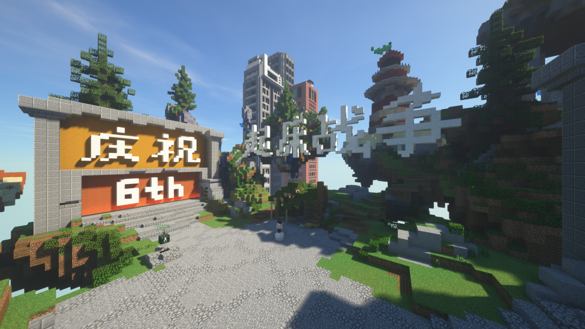

# 起床战争简述

::: tip 游戏玩法
「起床战争」是一个团队合作的 PvP 游戏，你需要与队友从生成点及附近岛屿收集资源（铁锭、金锭、钻石及绿宝石）。你可以使用这些资源购买武器和物品。

保护自己队伍的床并摧毁其他队伍的床并击杀所有敌人即可获胜。

:::

::: warning 注意事项
- 任何作弊 / 外挂是不被允许的
- 公认的辅助 Mod （如按键显示等）是可以接受的
- **请不要在游戏过程中退出，这将会导致你无法再次加入当前游戏**
:::

起床战争分为初赛、复赛、半决赛和决赛四轮。前一轮比赛的优胜者可晋级至后一轮比赛，直至决出最后的优胜者。

初赛和复赛将举行多场比赛，具体比赛时间请查看 [活动时间表](../schedule.html)。**比赛时间、轮次、场次和可能根据报名情况变更**，请注意关注六周年庆典玩家群、本页面和我们的 Twitter 账号，以获取活动的最新动态。

有关各轮比赛的具体规则，请查看左侧菜单中的链接；有关起床战争环节的奖品的信息，请查看 [奖品列表](../rewards.html)。

<!-- ::: tip 提示
初赛各场次的玩家列表已经公布，[*点击查看 >>>*](./players/preliminary.html)
::: -->

## 地图信息

- 所有地图归 [Hypixel](https://hypixel.net) 所有。
- 由 MCBBS 用户 TheRam_ 制作，[原帖地址](https://www.mcbbs.net/thread-845445-1-1.html)。
- 游戏版本：1.8.9

## 游戏地图和队伍选择
点击大厅的 NPC 或使用手中的指南针，选择地图选择器，按照管理员的分配选择对应的地图。

使用手中的床，选择你想要的队伍。此时选择的队伍不代表你最终的组队，请以实际为准。

在完成上述操作后，请耐心等待游戏开始。

## 组队规则

<!-- - 所有赛事采用团队战形式，玩家们可以自由结合（一队上限为4人），或者也可以由系统自动分配；
  - 自由组队需要自由组队的玩家（最多4人）在初赛前进行自由结合，并将玩家名单于结束次日 8 时前向执行组说明团队成员；
  - 自动分配将会在初赛时随机分配四人小组，此小组在初赛时就会被锁定，在晋级后也不能重新参与自由结合。 -->

## 比赛场次选择

报名参与起床战争的选手可以在初赛、复赛和半决赛阶段选择自己参与的比赛场次。如未选择比赛场次，则将由运营组随机安排。

报名完成后，请加入 [QQ 群 917470359](https://jq.qq.com/?_wv=1027&k=os9EsvoG)，根据群公告的指引选择参与的比赛场次。如场次选择结束时选手仍未选择自己的比赛场次，则将由运营组随机安排。

初赛的比赛场次安排将于 2022 年 x 月 xx 日凌晨发布，复赛的比赛场次安排将于 2022 年 x 月 xx 日中午 xx 时前发布，半决赛的比赛场次安排将于 2022 年 x 月 xx 日中午 12 时前发布，请留意。

## 游戏服务器信息

<!-- - 服务器 IP：`bw.6th.littlesk.in` -->

服务器 IP 将择日放出，请关注我们的群组和 Twitter 以获取最新消息。

Minecraft 版本：1.8.9

进入服务器需要使用 LittleSkin 的 Yggdrasil API 登录。如需了解如何登录，请查看 [在客户端使用 Yggdrasil API 登录](/advanced/yggdrasil.html#%E5%9C%A8%E5%AE%A2%E6%88%B7%E7%AB%AF%E4%BD%BF%E7%94%A8)。

<!-- ## 获奖信息

起床战争获奖信息已发布，请 [_点击查看 >>>_](../winner.html#起床战争) -->
